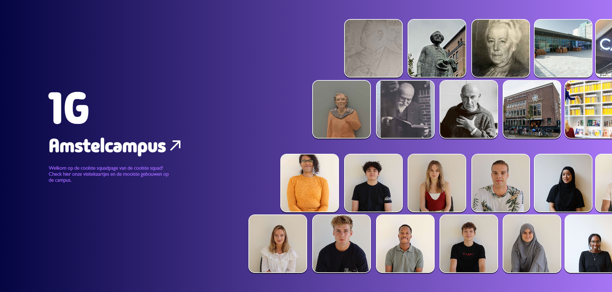
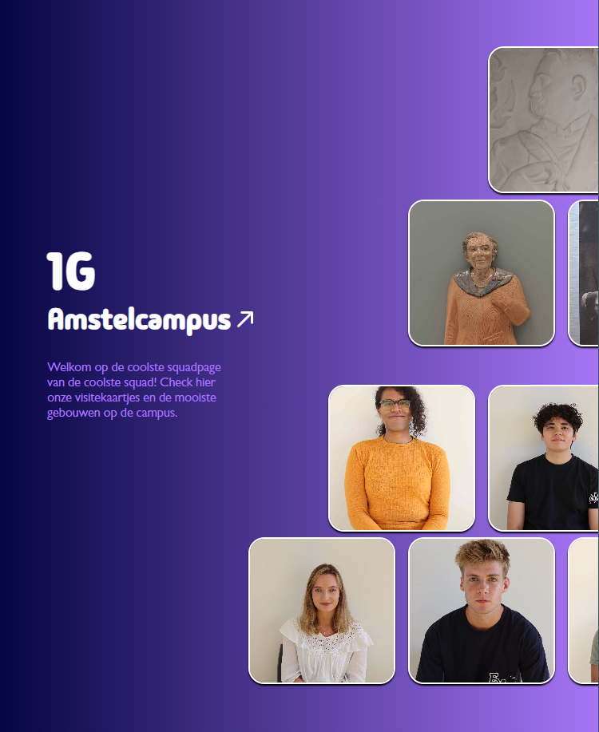
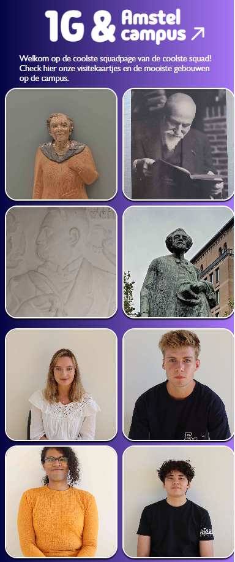
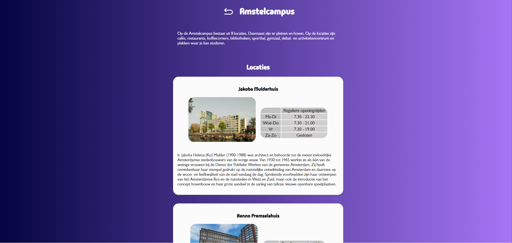
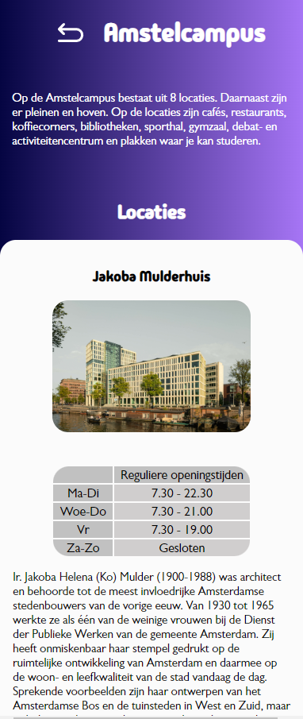
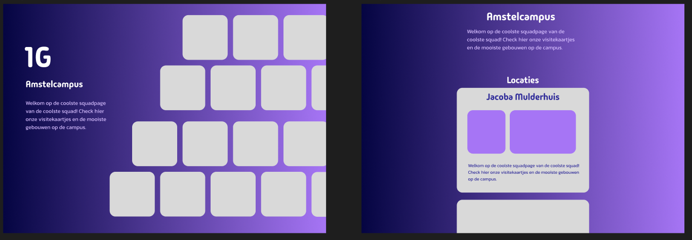

# Squad page
Wij hebben een squad page gemaakt waar je de visitekaartjes kan zien van iedereen in de squad 1G. Daarnaast kun je informatie vinden over de gebouwen op de Amstelcampus, zoals de openingstijden en locaties van de koffiecorners.
We wilden hem lekker simpel & overzichtelijk houden, maar toch aesthetically pleasing, en makkelijk te navigeren!

## Linkje (klik klik klikken!)
https://edu.nl/46aen

## Features
### Animaties
We hebben enkele elementen geanimeerd: de foto's op de homepagina worden iets groter en lichtenop, op het moment dat je er met de muis overheen hovert. Ook worden de linkjes en de tabelletjes op de amstelpagina paars.

### Homepagina grid
De grid op de homepagina heeft alle linkjes naar de visitekaartjes en gebouwen, en scrollt horizontaal. Met behulp van een scriptje is het mogelijk om met een scrollwheel horizontaal er door heen te scrollen zonder extra toetsen te gebruiken.

### Shortcuts
De linkjes naar de Amstelcampus gebouwen springen direct naar het relevante gebouw, zodat er minder gescrollt hoeft te worden. Alle linkjes die naar een externe website verwijzen, openen in een nieuw tabblad.

## Screenshots
### Homepagina

### Amstelpagina

### Ontwerp (figma)

## Ons team
Wij zijn de Squid Squad - Athene Guanipa, Nadia Visser en Iris van Willigen.
Meer informatie kun je vinden op onze visitekaartjes, of onze GitHubs.